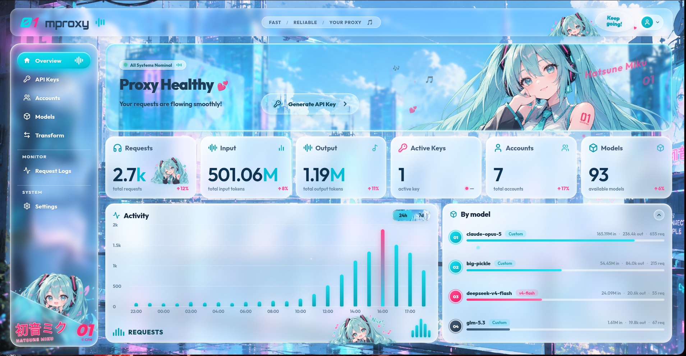

# 🎵 Hatsune Miku Liquid Glass Dashboard (mproxy)

<div align="center">


A futuristic, cyber-aesthetic AI proxy and metrics dashboard built with React and advanced CSS Liquid Glass morphism, inspired by **Hatsune Miku (01)**.

</div>

---

## 📸 Preview

<div align="center">
  
</div>

---

## ✨ Highlights & Features

- **Liquid Glass Aesthetic & Refraction**:
  - Custom SVG displacement maps (`feTurbulence` + `feDisplacementMap`) simulating optical glass distortion and caustic edge light.
  - Multi-layered specular highlights, soft translucent frost, and ambient cyber dust particles.
  - Refractive buttons with dynamic gradient borders, realistic inner reflections, and tactile micro-interactions.

- **Vocaloid & Hatsune Miku Cyber Theme**:
  - Signature Miku cyan (`#00F0FF`) and magenta (`#FF4B93`) visual identity.
  - Micro-animated equalizers, audio soundwaves, and floating musical note runes.
  - Chibi cheering badges, 3D tilted Miku artwork accents, and holographic typography.

- **Interactive Component Suite**:
  - **Fluid Sidebar**: Smooth spring-based sliding pill indicators for both active and hover states.
  - **Top Glass Navigation**: Status ticker, cheer capsule, and frosted profile dropdown menu.
  - **Hero Status Banner**: System nominal pill with animated live pulse and "Generate API Key" liquid glass button.
  - **Key Metrics Grid**: Live throughput, token counts (input/output), active keys, accounts, and model counters.
  - **Activity Timeline Chart**: Dual time-range toggle (`24h` / `7d`) with sliding indicator, hoverable peak bars, and live tooltips.
  - **Model Breakdown**: Usage breakdown bars, custom tag pills, and collapsible glass chevron toggle.
  - **API Key Generator Modal**: Frosted glass modal with one-click cryptographic key generation and clipboard copy feedback.

---

## 🛠 Tech Stack

- **Core**: [React 18](https://react.dev/)
- **Build Tool**: [Vite](https://vitejs.dev/)
- **Icons**: [Lucide React](https://lucide.dev/)
- **Styling**: Vanilla CSS (CSS Variables, SVG Displacement Filters, Backdrop Filters, Keyframe Animations)
- **Typography**: Outfit, Plus Jakarta Sans, Orbitron, JetBrains Mono

---

## 🚀 Getting Started

### Prerequisites

Ensure you have [Node.js](https://nodejs.org/) (v18 or newer) installed.

### Installation

1. **Clone the repository**:
   ```bash
   git clone https://github.com/moadabdou/miku-liquid-glass-dashboard.git
   cd miku-liquid-glass-dashboard
   ```

2. **Install dependencies**:
   ```bash
   npm install
   ```

3. **Start the development server**:
   ```bash
   npm run dev
   ```

4. **Build for production**:
   ```bash
   npm run build
   ```

---

## 📁 Project Structure

```
├── design/
│   └── ui.png                 # Dashboard UI screenshot
├── public/
│   └── assets/                # Artwork, chibi illustrations, and splash graphics
├── src/
│   ├── components/
│   │   ├── ActivityChart.jsx  # 24h / 7d interactive bar chart
│   │   ├── ApiKeyModal.jsx    # Glassmorphic API key generator modal
│   │   ├── HeroBanner.jsx     # Hero status banner & action button
│   │   ├── MetricsGrid.jsx    # Overview KPI metrics cards
│   │   ├── ModelBreakdown.jsx # Model usage breakdown list
│   │   ├── Navbar.jsx         # Glass top navigation bar
│   │   └── Sidebar.jsx        # Fluid sliding navigation sidebar
│   ├── App.jsx                # Main application layout & SVG filters
│   ├── index.css              # Design system & liquid glass styling
│   └── main.jsx               # Application entry point
├── package.json
└── vite.config.js
```

---

## 📄 License

This project is open source and available under the [MIT License](LICENSE).
Hatsune Miku character artwork and likeness © Crypton Future Media, INC.
